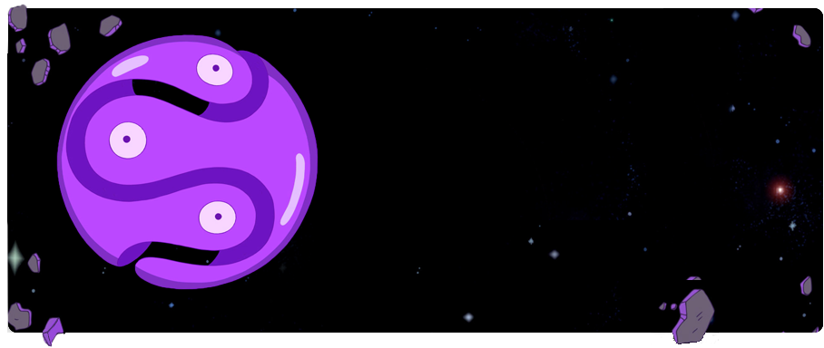
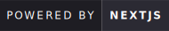

<!-- CV:  -->

<!--

  
  
  

 -->

  
Hi 👋. I am **Parsa Ny**, a developer, computer science senior student and an AI engineer. I specialize in Web Development, Programming, Machine learning and AI. I love to network, join new communities and add value ⚡️

  
🏞️ Current Status

- 🔭 I work on various projects, from **Personal** projects to **contract based**

- 🌱 sometimes post blog posts over my **Telegram channel and website**

- 🤝 I’m looking for help with **finding projects to contribute to!**

  

  

<!--

  
📕 Blog Posts

   

-->

## 🔥 Github Stats

## 📘 My top open source projects

-------------------------

    

 

    

 
 

-------------------------

    
website:

    

