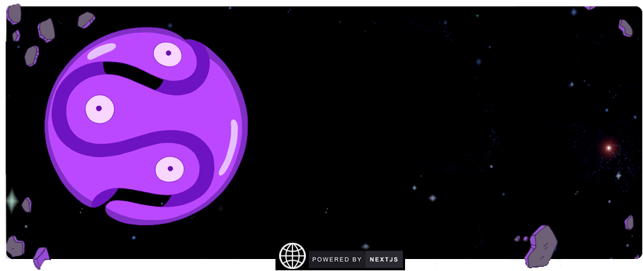

<!-- CV:  -->

<!--

  
  
  

 -->

<!-- **f** -->

  
Hi 👋. **Parsa Ny**, a software engineer, computer science bachelor, AI engineer. currently shipping software (contact enquiry made on telegram or whatsapp) at lightspeed performance ⚡️

## 🔥 Github Stats

